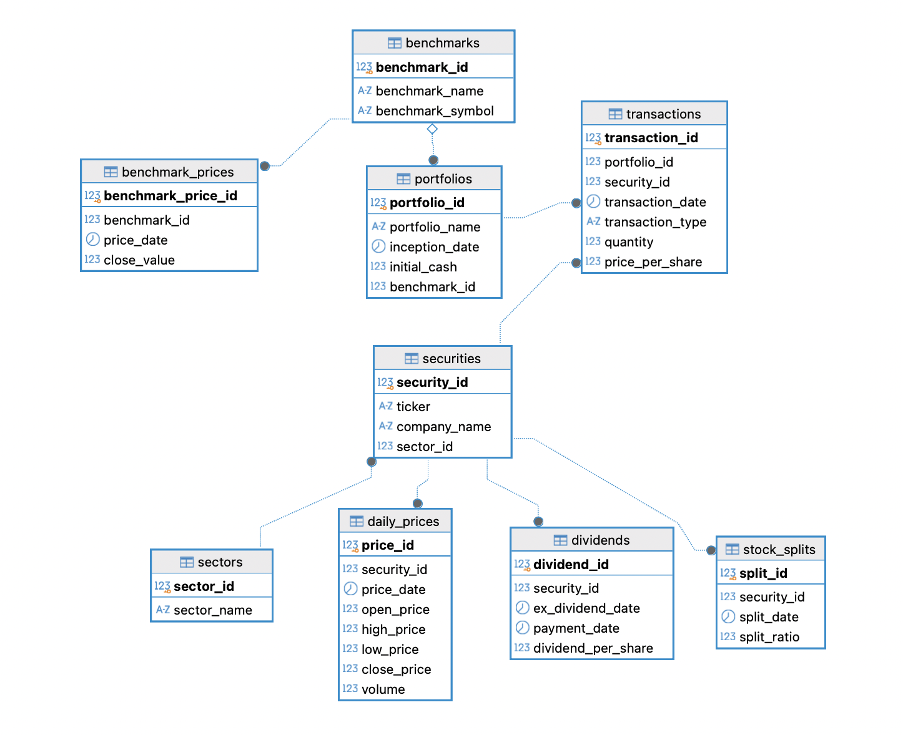
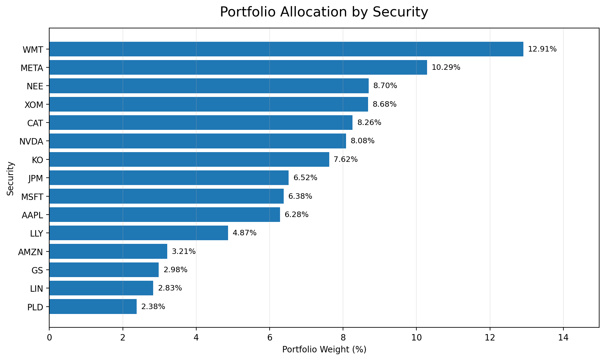
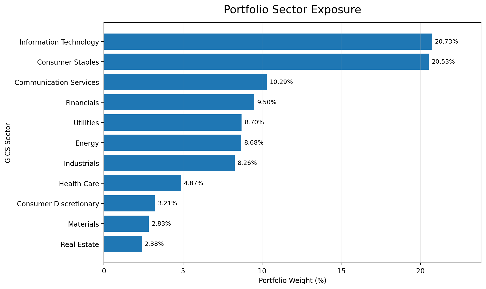
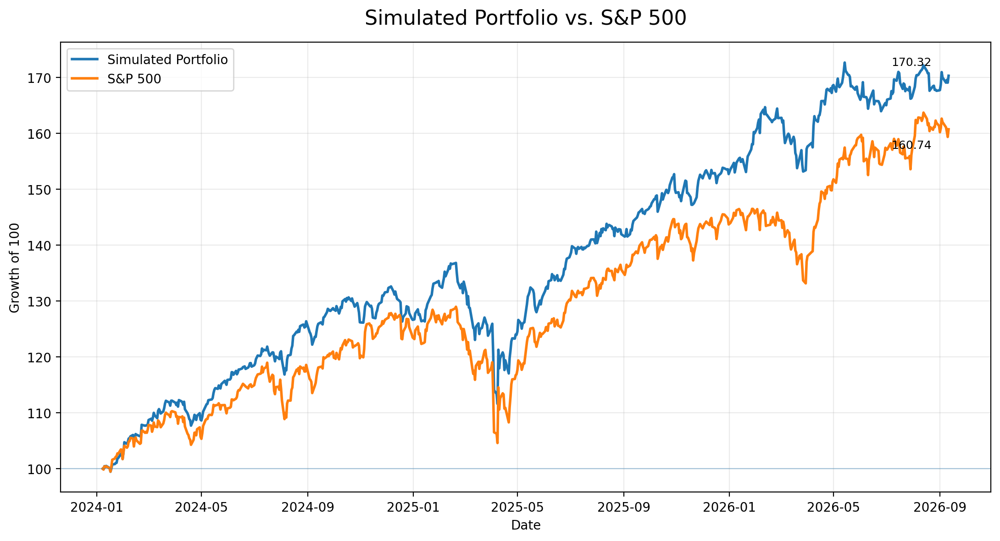

# Investment Portfolio Analytics

A SQL-based investment portfolio analytics project built with PostgreSQL using historical market data, simulated portfolio transactions, and S&P 500 benchmarking.

The project models an investment portfolio database and uses SQL to analyze portfolio performance, asset allocation, sector exposure, concentration risk, security-level gains and losses, and benchmark-relative performance.

## Project Overview

This project was built to demonstrate how SQL can be used to organize and analyze investment portfolio data.

The database combines historical security prices with simulated portfolio transactions to evaluate the performance and composition of a simulated $1,000,000 investment portfolio.

The analysis focuses on:

- Portfolio holdings and market value
- Portfolio allocation by security
- Sector exposure
- Portfolio concentration
- Security-level gains and losses
- Return contribution
- Overall portfolio performance
- S&P 500 benchmark comparison
- Historical portfolio performance

## Technologies Used

- PostgreSQL
- SQL
- DBeaver
- GitHub
- Historical Market Data

## Database Design

The PostgreSQL database contains the following tables:

- `portfolios` — portfolio information and starting capital
- `transactions` — simulated buy and sell transactions
- `securities` — security tickers and company information
- `sectors` — GICS sector classifications
- `daily_prices` — historical security price data
- `benchmarks` — benchmark information
- `benchmark_prices` — historical benchmark values
- `dividends` — structure for dividend information
- `stock_splits` — stock split reference data

Primary and foreign keys connect the tables and allow portfolio, security, sector, transaction, and market data to be analyzed together.

The complete PostgreSQL database structure, including tables, primary keys, foreign keys, constraints, and indexes, can be found in:

`sql/database_schema.sql`

## Entity Relationship Diagram



## Dataset

The simulated portfolio begins with **$1,000,000 in initial capital** and contains **15 publicly traded companies representing all 11 GICS sectors**.

Historical daily security price data covers the period from January 2024 through September 2026.

### Historical Market Data

Historical daily stock price data was sourced from **Nasdaq** and loaded into PostgreSQL for analysis.

The historical dataset contains daily open, high, low, close, and volume data for each of the 15 securities in the portfolio. The database contains more than 10,000 daily security price records across the analysis period.

The individual raw historical stock-price CSV files are not included in this repository. Instead, they were used as source data for the PostgreSQL `daily_prices` table.

### Portfolio Transactions

Portfolio transactions are **simulated** and were created specifically for this project.

The transaction dataset contains BUY and SELL activity across the portfolio's securities using historical market prices and trading dates. The simulated transactions were structured to maintain a long-only portfolio without selling more shares than were held.

The transaction dataset used in the project is included in:

`data/Simulated_Portfolio_Transactions.csv`

### Benchmark Data

The **S&P 500 price-return index** is used as the portfolio benchmark.

Historical benchmark data is stored in PostgreSQL and used to compare the simulated portfolio's cumulative performance against the broader U.S. equity market.

The benchmark dataset used in the project is included in:

`data/SP500_Benchmark_Prices_Import.csv`

## Portfolio Analytics

SQL was used to calculate and analyze:

1. Current portfolio holdings
2. Market value by security
3. Portfolio weight by security
4. Sector exposure
5. Portfolio concentration
6. Portfolio return
7. S&P 500 benchmark return
8. Excess return
9. Security-level gain/loss
10. Return contribution by security

The PostgreSQL database schema and complete SQL analysis can be found in:

`sql/database_schema.sql`

`sql/portfolio_analytics.sql`

## Key Findings

### Portfolio Performance

From January 8, 2024 through September 11, 2026, the simulated portfolio generated a cumulative return of:

**70.32%**

Over the same period, the S&P 500 generated:

**60.74%**

This resulted in:

**+9.58 percentage points of outperformance**

### Portfolio Concentration

The five largest positions represented:

**48.85% of invested portfolio assets**

The largest individual position was:

**Walmart (WMT) — 12.91%**

### Sector Exposure

The portfolio's largest sector exposure was:

**Information Technology — 20.73%**

Consumer Staples was the second-largest sector exposure at:

**20.53%**

The portfolio maintained exposure across all 11 GICS sectors.

### Return Contribution

The largest positive contributor was:

**NVIDIA (NVDA) — +12.44 percentage points**

Other major contributors included:

- Walmart (WMT): +11.02 percentage points
- Caterpillar (CAT): +8.84 percentage points
- JPMorgan Chase (JPM): +5.34 percentage points
- Exxon Mobil (XOM): +5.22 percentage points
- Meta Platforms (META): +5.06 percentage points

Prologis (PLD) was the only negative contributor in the final security-level analysis:

**PLD — -0.89 percentage points**

## Visualizations

### Portfolio Allocation by Security



This visualization shows the distribution of invested portfolio market value across individual securities.

### Portfolio Sector Exposure



This visualization shows invested portfolio market value allocated across the 11 GICS sectors represented in the portfolio.

### Portfolio vs. S&P 500



Both the portfolio and S&P 500 are indexed to 100 on January 8, 2024 to provide an equal starting point for the performance comparison.

By September 11, 2026, the simulated portfolio reached an indexed value of **170.32**, compared with **160.74** for the S&P 500.

This represents cumulative returns of **70.32%** and **60.74%**, respectively, resulting in **9.58 percentage points of portfolio outperformance** over the analyzed period.

## Repository Structure

```text
investment-portfolio-analytics/
│
├── data/
│   ├── README.md
│   ├── Simulated_Portfolio_Transactions.csv
│   └── SP500_Benchmark_Prices_Import.csv
│
├── images/
│   ├── README.md
│   ├── Investment_Portfolio_ERD.png
│   ├── Portfolio_Allocation_by_Security.png
│   ├── Portfolio_Sector_Exposure.png
│   └── Portfolio_vs_SP500_Performance.png
│
├── sql/
│   ├── database_schema.sql
│   └── portfolio_analytics.sql
│
└── README.md
```

## How to Run

1. Create a PostgreSQL database.
2. Run `sql/database_schema.sql` to create the database tables, relationships, constraints, and indexes.
3. Load the historical security price data into the `daily_prices` table.
4. Import the simulated portfolio transactions and S&P 500 benchmark data.
5. Run the queries contained in `sql/portfolio_analytics.sql`.
6. Review the resulting portfolio analytics and visualizations.

## Methodology and Data Notes

Historical market prices represent actual historical market data, while the portfolio itself and its transactions are simulated for educational and analytical purposes.

Historical security prices used in the analysis reflect the source-adjusted historical series. Stock split information is maintained separately as reference data in the `stock_splits` table and is not applied again to portfolio holdings, avoiding double-adjustment of historical prices.

Portfolio performance in this project is based on price appreciation and transaction activity and does not incorporate dividend income. For this reason, the **S&P 500 price-return index** is used for the benchmark comparison rather than a total-return index that assumes dividend reinvestment.

Security-level gain/loss analysis compares current security value with net cash invested through BUY and SELL transactions. It is intended as a portfolio contribution analysis rather than a tax-lot-based realized and unrealized P&L calculation.

All portfolio transactions are simulated and do not represent actual investment activity. Results should not be interpreted as investment advice or actual investment performance.

## Purpose

This project demonstrates the application of SQL and relational database design to financial analysis, including:

- Relational database design
- Primary and foreign key relationships
- SQL joins and aggregations
- Common Table Expressions (CTEs)
- Historical financial data management
- Portfolio performance measurement
- Benchmark comparison
- Sector and concentration analysis
- Security-level return contribution
- Data validation and transformation
